# Tech spec: scope SSE event subscriptions to open parent/child conversations

## Context

`OrchestrationEventStreamer` (`app/src/ai/blocklist/orchestration_event_streamer.rs`) delivers v2 orchestration events (cross-agent messages and lifecycle events) into a conversation by holding a long-lived SSE connection per conversation. The polling fallback path is being removed in a separate change — once the `OrchestrationEventPush` flag is gone, the poller code is SSE-only and gated solely on `OrchestrationV2`. This spec assumes the polling path no longer exists, so the only state and code paths described below are the SSE ones.

A key semantic to keep in mind throughout: **an agent run subscribes to its own `run_id` because that subscription is its inbox.** Server-side, `AgentEventDriverConfig::run_ids` filters events whose run_id matches the set; for a given agent run, events with `run_id == self_run_id` are messages and lifecycle signals destined for that run. Both parent agent runs and child agent runs (including headless CLI children of any harness) must keep this subscription up while their run is active in order to receive messages.

Today the lifecycle is wrong in three ways:

1. **Wrong start trigger.** SSE only opens on the `ConversationStatus::Success` transition (`orchestration_event_streamer.rs:229-237`, `start_event_delivery` at line 494). A conversation that is open in the UI but still in-progress will not subscribe; conversely once it has subscribed, status no longer matters.
2. **Wrong stop trigger for parents.** Cleanup only runs on `RemoveConversation`/`DeletedConversation` (lines 178-193). Closing the agent view of a parent conversation does not tear down its SSE, so a parent the user has abandoned in the UI keeps a live connection.
3. **Wrong scope.** `on_server_token_assigned` (line 240) registers the conversation's own run_id for *every* cloud-backed conversation that gets a server token (except shared-session viewers, line 254). Solo conversations — neither parents (have spawned children) nor children (`parent_conversation_id` set) — are not part of an orchestration tree and cannot meaningfully receive or send orchestration events. They should not subscribe.

There is also a related state-leak: `register_watched_run_id` (line 138) only inserts into `watched_run_ids`; nothing removes a child's run_id when the child finishes or is deleted. A long-lived parent accumulates dead run_ids and reconnects with an ever-growing filter.

### Relevant code

- `app/src/ai/blocklist/orchestration_event_streamer.rs` — owner of `watched_run_ids`, `sse_connections`, polling/SSE timers, and all cleanup paths.
- `app/src/ai/blocklist/action_model/execute/start_agent.rs:112-119` — the only external caller of `register_watched_run_id`, registering a *child's* run_id under the *parent's* `AIConversationId` when the child receives a server token.
- `app/src/ai/active_agent_views_model.rs` — already tracks "is this conversation expanded in any pane?" via `agent_view_handles`. Emits `ActiveAgentViewsEvent::ConversationClosed { conversation_id }` on `ExitedAgentView` (line 167-169) and on `unregister_agent_view_controller` from the pane-close path (line 200-202; see `pane_group/pane/terminal_pane.rs:383-385`). Helper `is_conversation_open(conversation_id, ctx)` (line 354) gives the cross-pane "open anywhere?" check.
- `app/src/ai/agent/conversation.rs:781-792` — `parent_conversation_id()` and `is_child_agent_conversation()` classify a conversation as child or non-child; combined with the poller's own `watched_run_ids` set these classify a conversation as parent/child/solo.
- `app/src/ai/agent_events/driver.rs (38-50, 177-199)` — `AgentEventDriverConfig::run_ids` is forwarded to `ServerApi::stream_agent_events` and is the server-side filter for which events come back. A run watching its own run_id is using that subscription as its inbox.
- `app/src/ai/agent_sdk/driver.rs` — drives Oz conversations headlessly via the Warp CLI (locally for `start_agent` with `execution_mode: local` + Oz harness, and on cloud workers for cloud Oz runs). The same `OrchestrationEventStreamer` singleton is registered here (`lib.rs:1564-1566` is unconditional aside from the `OrchestrationV2` feature flag), so the poller must serve a CLI/cloud process where there are no `AgentViewController` registrations at all.

## Proposed changes

### Consumer abstraction

The poller's job is to deliver events to a consumer. Today there is one implicit consumer (the agent view), but in CLI and cloud worker processes the consumer is the `agent_sdk::driver` itself, which has no agent view. Generalize this: the poller owns a set of registered *consumers* per conversation, where a consumer is anything that needs orchestration events delivered for that conversation.

The registry lives **inside `OrchestrationEventStreamer`** as new state — e.g. `consumers: HashMap<AIConversationId, HashSet<ConsumerId>>` plus a small `ConsumerId` newtype — with two public methods on the poller:

- `register_consumer(conversation_id, consumer_id, ctx)` — inserts and re-evaluates eligibility, calling `start_event_delivery` if the conversation is newly eligible.
- `unregister_consumer(conversation_id, consumer_id, ctx)` — removes and re-evaluates eligibility, tearing down the SSE if the conversation is no longer eligible.

This avoids introducing a separate singleton and the event-subscribe plumbing that would come with it. The poller is the only consumer of these signals, so co-locating the state keeps the lifecycle decisions in one place.

Two callers wire up registrations:

- The agent view path: `AgentViewController` calls `register_consumer` / `unregister_consumer` around its lifetime, mirroring its existing `register_agent_view_controller` / `unregister_agent_view_controller` calls. The poller does not subscribe to `ActiveAgentViewsModel` for this; the registration is direct.
- The driver path: `agent_sdk::driver` calls the same methods around its run lifetime.

The poller's eligibility check observes a single signal — `has_active_consumer(conversation_id)` reads from its own `consumers` map — and does not care which type registered. In the GUI client this collapses to "agent view is open somewhere"; in CLI/cloud workers it collapses to "the driver is running."

`ConsumerId` only needs to be unique enough to allow multiple concurrent registrations to coexist (e.g. agent view + driver, two agent views in different panes) and to support a clean unregister. A `Uuid` generated by the caller, or a typed enum like `ConsumerId::AgentView(EntityId) | ConsumerId::Driver(uuid::Uuid)`, both work.

### Eligibility predicate

The poller treats parent and child agent runs differently because the trigger conditions are different, but both check the same consumer signal.

**Child role** — `Conversation::is_child_agent_conversation()` is true (`parent_conversation_id` is set). The subscription is the child's inbox. It must be live whenever the child run exists, regardless of consumer registration. In practice every live child has at least one consumer (its driver, in CLI/cloud, or its agent view, in the GUI), and the inbox must be on whenever the run is alive so the consumer can act on incoming messages. This applies to every harness — Oz, ClaudeCode, Gemini, headless CLI children spawned via `start_agent` with `execution_mode: local`, and cloud children. Children today cannot themselves spawn children; if that constraint is lifted later, this role keeps applying unchanged.

**Parent role** — the conversation has at least one child run_id registered in `watched_run_ids` (from `register_watched_run_id` in `start_agent.rs`). The subscription delivers child lifecycle and child→parent messages into the parent's consumer. The parent role is gated on having an active consumer. In the GUI that means the agent view is open; in CLI/cloud it means the agent driver is running. When the last consumer for a parent disappears, child events for that parent are stored on the server and backfilled via the cursor when a consumer comes back.

Today, child agent runs cannot themselves spawn children, so no live conversation simultaneously holds both roles. The design must still admit the case so that allowing children-of-children later is a code change to the spawn path, not to the subscription model. Both roles' run_id contributions are unioned into the SSE filter whenever both apply.

The stronger present-day motivator for the consumer abstraction is a different shape: a top-level cloud Oz agent run — not itself a child — that spawns children. It has the parent role only, runs on a cloud worker with no agent view, and is driven by the agent_sdk driver. Without the consumer abstraction the parent gate would never be satisfied (no agent view ever exists in that process) and the cloud Oz agent could not receive its children's events. With the abstraction the driver registers as the consumer and the parent role is eligible.

**Solo conversations** — neither parent nor child — are excluded. They have no role in the orchestration tree and no inbox traffic to receive.

Formally, a conversation should be subscribed iff:

```
is_child_agent_conversation()
  OR (has_at_least_one_watched_child_run_id() AND has_active_consumer())
```

Where `has_active_consumer()` returns true when at least one `AgentViewController` or `agent_sdk::driver` is registered for this conversation. This predicate is the single invariant the poller maintains. Every code path either makes a conversation eligible (and ensures a connection exists) or makes it ineligible (and tears the connection down).

### Subscription drivers

**Children.** The trigger is server-token assignment, not status. In `on_server_token_assigned`, register the self run_id and call `start_event_delivery` immediately when `is_child_agent_conversation()` is true. Drop the `became_success` gate — children must be listening as soon as they have a run_id, regardless of status. Teardown for children happens only on `RemoveConversation` / `DeletedConversation` (existing logic).

**Parents.** Subscribe to a single "consumer changed" signal from the registry described above:

- On consumer-removed for a conversation: if `has_active_consumer()` returns false AND the conversation is not also a child, run the parent-only teardown described below. If it is also a child, leave the connection alone — the child role keeps it alive.
- On consumer-added for a conversation: re-evaluate eligibility and call `start_event_delivery` if newly eligible. This handles both the GUI reopen case (agent view opened after being closed) and the CLI startup case (driver registered before any agent view exists).
- `register_watched_run_id` (called from `start_agent.rs`) calls `start_event_delivery` after the insert. If a consumer exists, this opens or reconnects the SSE; if none exists, it is a no-op until a consumer registers.

`start_event_delivery` itself stops checking `became_success`; it verifies the eligibility predicate and opens an SSE connection. Status is no longer part of the lifecycle decision for either role.

The agent_sdk driver registers itself as a consumer at the start of its run (a natural place is `AgentDriver::execute_run` for Oz, or where the third-party harness path picks up the `task_id` for ThirdParty harnesses) and unregisters when the run terminates. Registration is by `AIConversationId` so it composes with the existing per-conversation poller state.

Because both roles share a single SSE connection per conversation, the SSE's `run_ids` filter must be the union of `{self_run_id}` (child role) and the registered child run_ids (parent role), where each role's contribution is included only when that role's eligibility is met. The simplest implementation is to compute the run_id list at SSE-open time from current state.

### Trigger ordering and re-evaluation

Eligibility depends on three pieces of state, each of which lands at a different time and is set by a different code path:

- `is_child_agent_conversation()` — set when a child conversation is created with `parent_conversation_id`. Available before any run_id is assigned.
- `self_run_id` — set on `ConversationServerTokenAssigned` for this conversation.
- Watched child run_ids on a parent — added by `register_watched_run_id` only after the *child* receives its server token (`start_agent.rs` waits for `ConversationServerTokenAssigned` on the child, then registers under the parent).

A consumer that registers earlier than any of these will not yet make the conversation eligible. That is fine: re-evaluation happens at every state change, so the SSE opens at the moment eligibility flips, regardless of which event arrived first. Concretely, the poller re-runs the predicate at exactly four sites:

1. `register_consumer` and `unregister_consumer` — consumer set changed.
2. `register_watched_run_id` — a child run_id was added to a parent's set.
3. `on_server_token_assigned` — this conversation received its run_id (and may now be a child).
4. `RemoveConversation` / `DeletedConversation` for any other conversation — if it was a child of this one, its run_id was just pruned from this parent's set; the parent may have no remaining children.

A consumer never needs to re-register on its own to chase the run_id. It registers once at the start of its lifetime and unregisters once at the end; the poller is responsible for catching up state changes in between.

A practical consequence for the GUI: opening an agent view for a brand-new conversation calls `register_consumer` immediately, but no SSE opens until either the conversation receives `ConversationServerTokenAssigned` (and is found to be a child) or `register_watched_run_id` runs against it (when its first child is spawned). For the CLI/cloud driver path the same applies: the driver registers immediately at run start, but the SSE waits until the run_id is assigned.

### Solo exclusion at registration time

Change `on_server_token_assigned` to register the conversation's own run_id only when the conversation is already a child (`is_child_agent_conversation()`). Conversations that are not yet children at server-token time may later become parents via `register_watched_run_id`; that path already handles parent registration without needing self_run_id, so solo conversations stay out of `watched_run_ids` entirely until and unless they enter the orchestration tree as a parent.

This avoids opening inbox subscriptions for conversations that have no orchestration role.

### Removal of stale child run_ids in a still-eligible parent

In the existing `RemoveConversation` / `DeletedConversation` arm, also walk every other entry in `watched_run_ids` and remove the closed conversation's run_id from each set. Capture the run_id from `BlocklistAIHistoryModel::conversation(conversation_id).and_then(|c| c.run_id())` before the conversation is removed (the event handler runs before history-model state is fully gone for `RemoveConversation`; for `DeletedConversation` we need the same guarantee — verify during implementation, fall back to passing the run_id on the event if necessary).

After the prune, re-evaluate the parent's eligibility:
- If the parent has remaining children and its view is still open, reconnect the SSE with the smaller run_id set.
- If the parent has no remaining children and is not itself a child, tear down its SSE.
- If the parent has no remaining children but is itself a child, keep the SSE alive for the child-role inbox.

### Reconnect behavior

`reconnect_sse` (line 666) currently checks `watched_run_ids.contains_key` before re-opening. Replace that with the full eligibility predicate: if the conversation is no longer eligible, drop the connection without reopening.

The proactive reconnect (`AgentEventDriverConfig::proactive_reconnect_after`, ~14 minutes) and error-driven reconnect both pass through this gate, so an ineligible conversation stops reconnecting automatically.

### Removal of dead status-tracking code

With the `became_success` gate gone, `on_conversation_status_updated` (line 211-238), the `conversation_statuses` field (line 95), and the `UpdatedConversationStatus` arm of `handle_history_event` have no remaining purpose. Remove them in this change. Also drop the `conversation_statuses.remove(...)` line from the `RemoveConversation` / `DeletedConversation` arm (line 188). Verify no other consumer of the poller depends on these fields before deletion.

### State machine

Replace "agent view open" with "has active consumer" in the parent gate; otherwise the same shape:

```mermaid
stateDiagram-v2
    [*] --> Solo: conversation created
    Solo --> ChildOnly: server token assigned and parent_conversation_id set
    Solo --> ParentOnly: child run_id registered while consumer active
    Solo --> ParentLatent: child run_id registered while no consumer
    ChildOnly --> ChildAndParent: registers a grandchild
    ParentOnly --> ParentLatent: last consumer unregisters
    ParentLatent --> ParentOnly: consumer registers
    ChildOnly --> Subscribed: SSE active (always-on inbox)
    ParentOnly --> Subscribed: SSE active (consumer present)
    ChildAndParent --> Subscribed: SSE active (both roles)
    Subscribed --> ChildOnly: parent role ends (no children + no consumer)
    Subscribed --> ParentOnly: child role ends (rare; only via removal)
    Subscribed --> [*]: conversation removed
    ChildOnly --> [*]: conversation removed
    ParentOnly --> [*]: conversation removed
    ParentLatent --> [*]: conversation removed
    Solo --> [*]: conversation removed
```



A conversation is in `Subscribed` iff there is an entry in `sse_connections`. Exiting `Subscribed` always tears down the SSE.

## Testing and validation

Add unit tests in `orchestration_event_streamer_tests.rs` covering the new invariants:

1. **Solo conversation does not subscribe.** Server token assigned for a conversation that is not a child and never spawns one; consumers come and go; status reaches Success → no entry in `sse_connections` at any point.
2. **Child subscribes immediately on server-token assignment regardless of consumer state.** A child conversation (parent_conversation_id set) gets server token while no consumer is registered → SSE is active. Adding/removing consumers does not affect the connection.
3. **Headless CLI child of any harness subscribes.** Cover Oz, ClaudeCode, and Gemini harness children spawned with `execution_mode: local` — each must have a live SSE once their run_id is assigned, with no agent view ever opened. The Oz CLI case must also have the agent_sdk driver registered as a consumer.
4. **Parent subscribes when first child is registered while a consumer is active.** Register a consumer first, then `register_watched_run_id` → connection opens.
5. **Parent latent until a consumer registers.** Children registered while no consumer exists → no connection. Consumer registers → connection opens with the right run_id list.
6. **Last consumer leaving tears down (parent-only conversation).** A subscribed parent that is not itself a child has its only consumer unregister; `sse_connections`/cursor/timer state are all gone. `watched_run_ids` is preserved so the parent can re-subscribe when a new consumer appears.
7. **Last consumer leaving does not tear down a parent-and-child conversation.** Forward-looking, since children cannot spawn children today; exercise the predicate by constructing a `Conversation` test fixture with both `parent_conversation_id` set and at least one watched child run_id. Verify it stays subscribed when its consumers leave (child role keeps it alive), and that the parent contribution is only present in the run_id filter while a consumer exists.
8. **Reconnect on consumer return.** Parent-only: last consumer leaves → consumer rejoins → new SSE connection opened with the latest cursor and the current set of child run_ids.
9. **Stale child run_id is pruned.** Parent with two children registered, one child conversation deleted → parent's `watched_run_ids` shrinks, SSE reconnects with the smaller set.
10. **Last child removed leaves a non-child parent with no role → teardown.** Parent that was never a child has its only child removed → connection torn down even if a consumer is still registered.
11. **Multiple consumers do not double-tear-down.** Two consumers (e.g. agent view + driver, or two agent views) for the same parent; one unregisters → SSE persists; second unregisters → SSE torn down.
12. **Cloud Oz parent (driver-only consumer) receives child events.** A top-level cloud Oz conversation (not itself a child) that spawns one or more children, with only the agent_sdk driver registered as a consumer (no agent view), must have all the child run_ids in the SSE filter — verifies that the consumer abstraction admits the driver to satisfy the parent gate. This is the present-day motivator for the abstraction.

Manual validation:

Observation setup. Two log streams cover everything below; have both open in separate terminals before each step.

- Client logs from the poller. Existing log lines: `Opening SSE stream for {conversation_id:?} (gen=..., run_ids=..., since=...)` (open) and `SSE driver exited for {conversation_id:?} (gen=...)` (close). The implementation must additionally log on `register_consumer` / `unregister_consumer` and on parent-only teardown so each lifecycle transition is visible. Tail the running client's log for the active build flavor (e.g. `~/Library/Logs/dev.warp.Warp-Stable/warp.log` or the equivalent for the dev build) and grep for `Opening SSE stream`, `SSE driver exited`, `register_consumer`, `unregister_consumer`.
- Server-side request log. With a local warp-server running, `stream_agent_events` HTTP requests appear in its access log. Filter by path: one request per active SSE; new requests on reconnect; disconnects when the client closes the stream.

Runbook. Each step gives expected client log output and server-side observation:

1. **Solo conversation — no subscription.** Start a regular cloud conversation that does not call `start_agent`. Expected client logs: no `Opening SSE stream` line. Server: no `stream_agent_events` request.
2. **Cloud Oz child — subscribes immediately on run_id assignment.** Spawn a child via `start_agent` (cloud Oz harness). Expected client log on the child: `Opening SSE stream for <child_id> ... run_ids=[<child_run_id>]` immediately when the child receives its server token, with no UI interaction. Expected server: one `stream_agent_events` request for the child. For the *parent*, the same line appears only after the parent's agent view is open AND a child has been registered — with `run_ids` containing the child's run_id.
3. **Local CLI child (claude-code) — subscribes without an agent view.** Spawn `start_agent` with `execution_mode: local` + `claude-code`. Expected client log: `Opening SSE stream` for the child appears even though no agent view was opened for the child's conversation. Send a message from the parent addressed to the child and confirm the claude-code harness receives it. Repeat with `gemini` if available.
4. **Top-level cloud Oz parent — subscribes via driver consumer.** Run a cloud Oz agent that spawns a child and observe the cloud worker's logs. Expected: `Opening SSE stream` for the parent inside the worker process, with `run_ids` containing the child's run_id. The driver registration should log on the worker side; without it the parent gate would not be satisfied.
5. **Parent pane close — parent SSE ends, child SSE persists.** With the parent's pane open and the child running, close the parent's pane. Expected client logs: `unregister_consumer` for the parent, then `SSE driver exited` for the parent. The child's `Opening SSE stream` line is *not* followed by an exit. Server: parent's `stream_agent_events` request disconnects; child's persists.
6. **Reopen parent — SSE re-establishes with current cursor.** Reopen the parent's agent view. Expected: `register_consumer` followed by `Opening SSE stream` for the parent with `since=<cursor>` matching the last persisted cursor.
7. **Stale child run_id pruned.** Spawn two children, then delete the second child's conversation. Expected: a new `Opening SSE stream` for the parent with `run_ids` shrunk by one (and a generation bump). Server: the previous parent `stream_agent_events` request disconnects, a new one opens with the smaller run_id list.
8. **Last child removed leaves a non-child parent with no role.** From step 7, delete the remaining child too. Expected: no new `Opening SSE stream` for the parent; the prior request disconnects and is not replaced. Client logs should show parent teardown.

Run `./script/presubmit` before opening the PR. Add a `CHANGELOG-IMPROVEMENT:` line for "Tighten orchestration event subscription scope: solo conversations no longer subscribe; parent subscriptions are tied to agent view openness; child subscriptions remain active for the lifetime of the run."

## Risks and mitigations

- **Race between server token assignment and consumer registration.** Re-deriving eligibility from current state on every consumer-add and on every `register_watched_run_id` call covers the ordering. Verify with unit tests.
- **Headless child without UI must still subscribe.** A regression here breaks message delivery to CLI subagents. Tests (3) and the manual CLI-child step are the primary safeguards. The implementation must not gate the child path on consumer presence — only the parent path is consumer-gated.
- **Driver lifecycle in the agent_sdk.** The driver must register and unregister at the right boundaries: register before any child can be spawned and unregister only after the run has terminated and any teardown work is complete. Registering too late means the driver misses early grandchild events; unregistering too early causes the same. Pin the registration to the run's outer scope in `AgentDriver::execute_run`.
- **Single SSE serves dual roles.** A conversation that is both child and parent uses one connection with a unioned run_id set. Reconnects must include both contributions; the run_id list should be recomputed each time the connection is opened or reconnected. Add an assertion to surface a divergence in tests.
- **Event ordering.** Consumer-removed and `RemoveConversation` may arrive in either order. Both paths run idempotent teardown — verify by making the teardown helper safe to call when the conversation is already gone.

## Follow-ups

- This spec assumes the `OrchestrationEventPush` flag and polling fallback are removed first. If that flag removal hasn't landed by the time implementation starts, additionally delete: `should_use_sse`, `poll_and_inject`, `start_idle_poll_timer`, `handle_event_batch`, `poll_backoff_index`, `poll_in_flight`, `pending_delivery` (the poll-only fields), and the `POLL_BACKOFF_STEPS` / `EVENT_POLL_BATCH_LIMIT` constants. Verify nothing outside the poller depends on them.
- Expose a debug snapshot from the poller (count of `sse_connections`, count of `watched_run_ids` entries, total run_ids across all sets, count of registered consumers per conversation, role classification per conversation) so we can monitor connection scope in production via a dev panel or telemetry.
